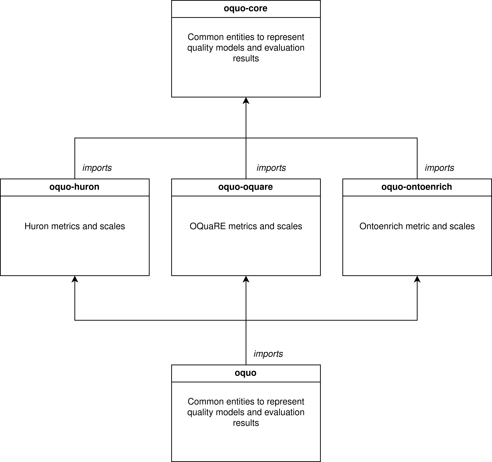
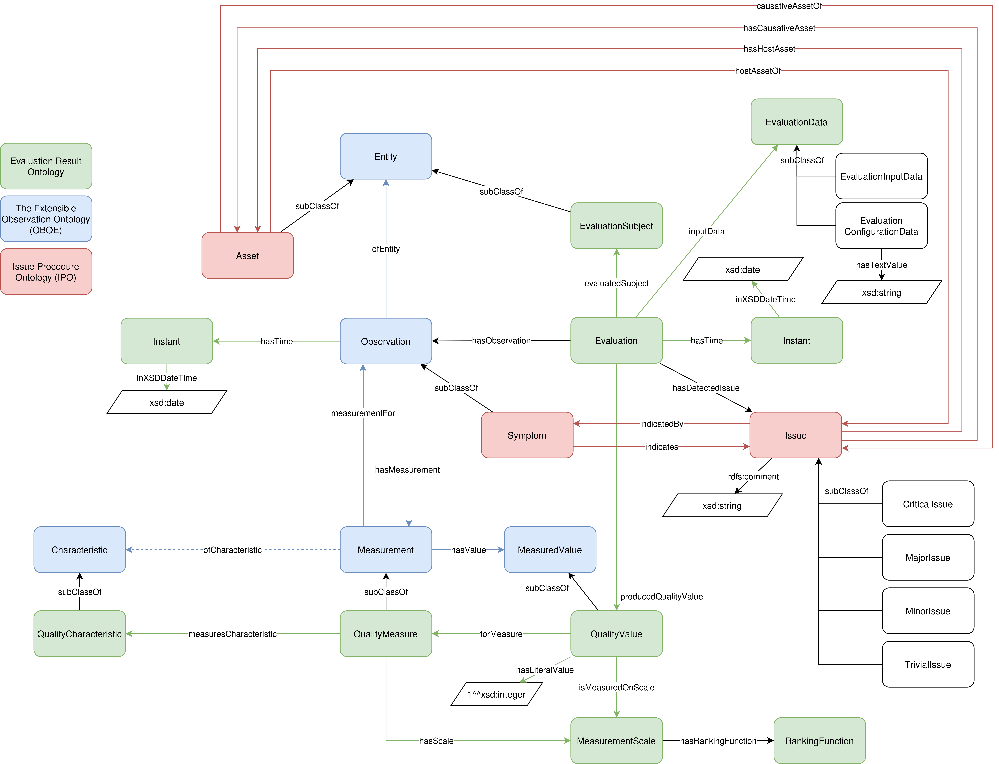
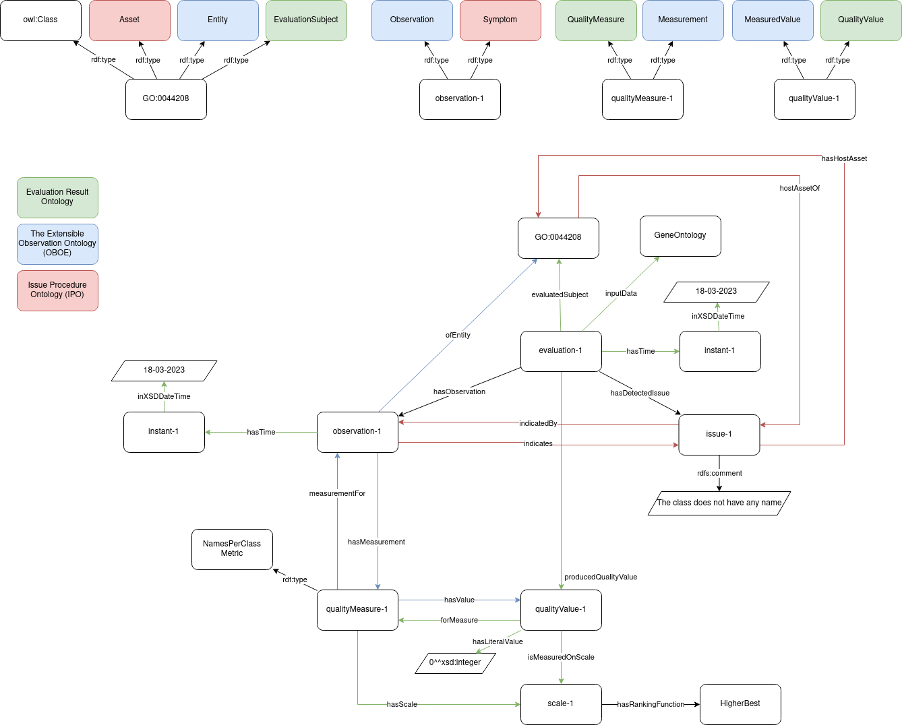
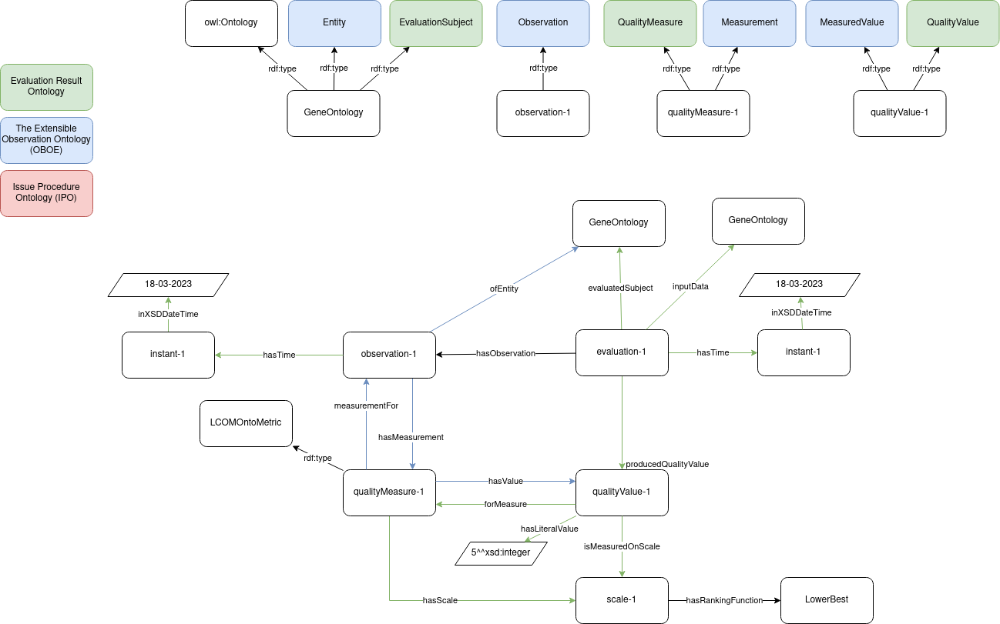

# OQUare Ontology (OQUO)
The OQUare Ontology (OQUO - [https://purl.archive.org/oquo](https://purl.archive.org/oquo)) is a modular ontology that contains the semantic definitions to represent quality models based on metrics, characteristics and subcharacteristics; in addition to the entities needed to represent ontology evaluations.

The OQUO ontology is composed by 5 modules that follows the architecture described in the next figure:

## Modules

### oquo-core
The module oquo-core ([https://purl.archive.org/oquo-core](https://purl.archive.org/oquo-core)) contains the common entities needed to represent quality models and evaluations. the module oquo-core is the result of reusing and aligning 4 different ontologies:

  - The Quality Model Ontology - [http://purl.org/net/QualityModel](http://purl.org/net/QualityModel)
  - The Evaluation Result Ontology - [http://purl.org/net/EvaluationResult](http://purl.org/net/EvaluationResult)
  - The Extensible Observation Ontology (OBOE) - [http://ecoinformatics.org/oboe/oboe.1.2/](http://ecoinformatics.org/oboe/oboe.1.2/)
  - The Issue Procedure Ontology (IPO) - [http://purl.org/ipo/core](http://purl.org/ipo/core)

The aligning of these ontologies resulted in the following schema:

### oquo-huron
The module oquo-huron ([https://purl.archive.org/oquo-huron](https://purl.archive.org/oquo-huron)) imports oquo-core and include the metrics, scales, and scale conversions from Huron[^huron]. The next figure shows an example of a result of applying the metric `names per class' to the gene ontology class GO:0044208:

### oquo-oquare
The module oquo-oquare ([https://purl.archive.org/oquo-oquare](https://purl.archive.org/oquo-oquare)) contains the information about the metrics included in OQuaRE[^oquare]. The next figure shows an example of a result of applying the metric `LCOMOnto' to Gene Ontology.

### oquo-ontoenrich
The module oquo-ontoenrich ([https://purl.archive.org/oquo-ontoenrich](https://purl.archive.org/oquo-ontoenrich)) contains the information about the metrics provided by ontoenrich[^ontoenrich].

[^huron]: [https://doi.org/10.1109/ACCESS.2023.3316512](https://doi.org/10.1109/ACCESS.2023.3316512)
[^oquare]: [https://search.informit.org/doi/abs/10.3316/ielapa.265844843145749](https://search.informit.org/doi/abs/10.3316/ielapa.265844843145749)
[^ontoenrich]: [https://doi.org/10.1007/978-3-319-17966-7_25](https://doi.org/10.1007/978-3-319-17966-7_25)